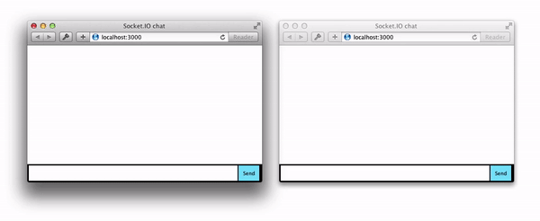

### Create basic chat application using socket.io server

- npm
  - express
  - http
  - socket.io
  - ejs
  - babel-cli (es6)
  - babel-preset-env (es6)

- Server
```js
import express from 'express';
import http from 'http';
import socketIO from 'socket.io';

const app = express();
const server = http.Server(app);
const io = socketIO(server);

io.on('connection', (socket) => {
  socket.on('chat message', (msg) => {
    io.emit('chat message', msg);
  });
});

export default server;
```

- Client
```js
const socket = io();

socket.emit('chat message', input.value);
socket.on('chat message', (msg) => {

});
```


```html
(EJS)
<script src="/socket.io/socket.io.js"></script>
```

- Demo
<p align='center'>
  
</p>

### To run the project
```
- cd chat-ejs
- npm i
- npm run dev

Server run on 3000
```