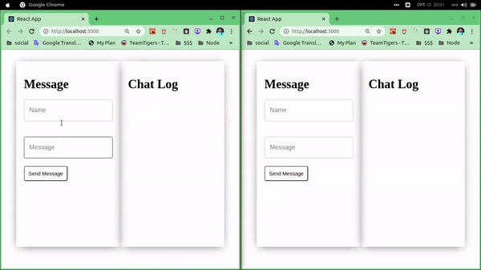

### Create basic chat application using socket.io server

- npm 
  - Server
    - express
    - http
    - socket.io
    - babel-cli (es6)
    - babel-preset-env (es6)
  - Client
    - react
    - react-dom
    - socket.io-client

- Server (NodeJS)
```js
import express from 'express';
import http from 'http';
import socketIO from 'socket.io';

const app = express();
const server = http.Server(app);
const io = socketIO(server);

io.on('connection', (socket) => {
  socket.on('chat message', (msg) => {
    io.emit('chat message', msg);
  });
});

export default server;
```

- Client (ReactJS)
```js
import io from 'socket.io-client';

useEffect(() => {
  socket.on('chat message', ({ name, message }) => {
    setChats([...chats, { name, message }])
  })
})

socket.emit('chat message', { name, message });

const renderChats = () => {
  return chats.map(({ name, message }, index) => (
    <div key={index}>
      <h3>
        {name}: <span>{message}</span>
      </h3>
    </div>
  ));
}
```

- Demo
<p align='center'>
  
</p>

### To run the project
```
* Server
- cd chat-react
- npm i
- npm run dev

Open Another Terminal

* Client
- cd chat-react
- cd client
- npm i
- npm start

```